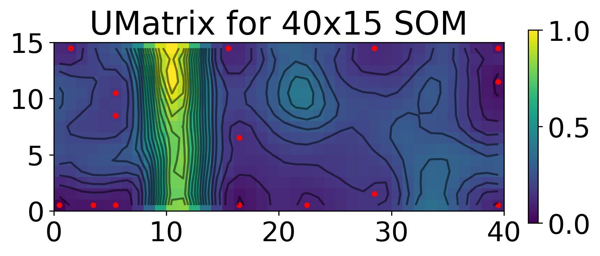
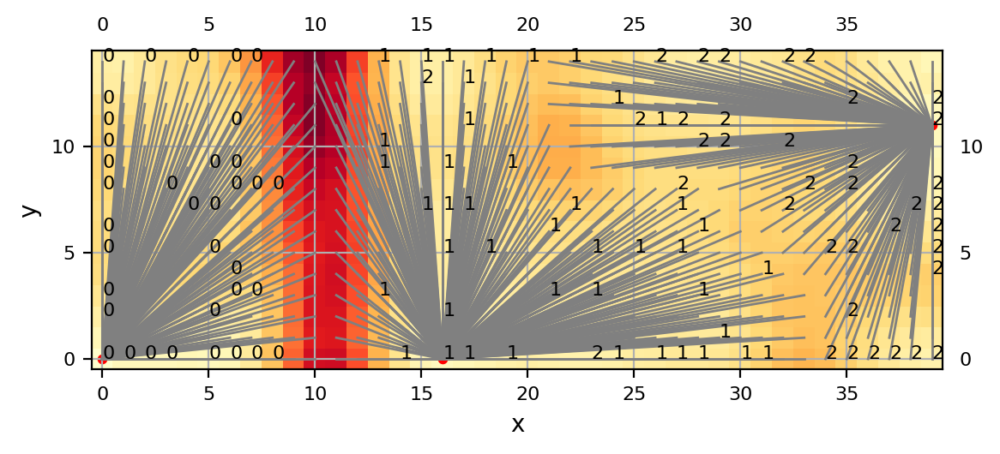
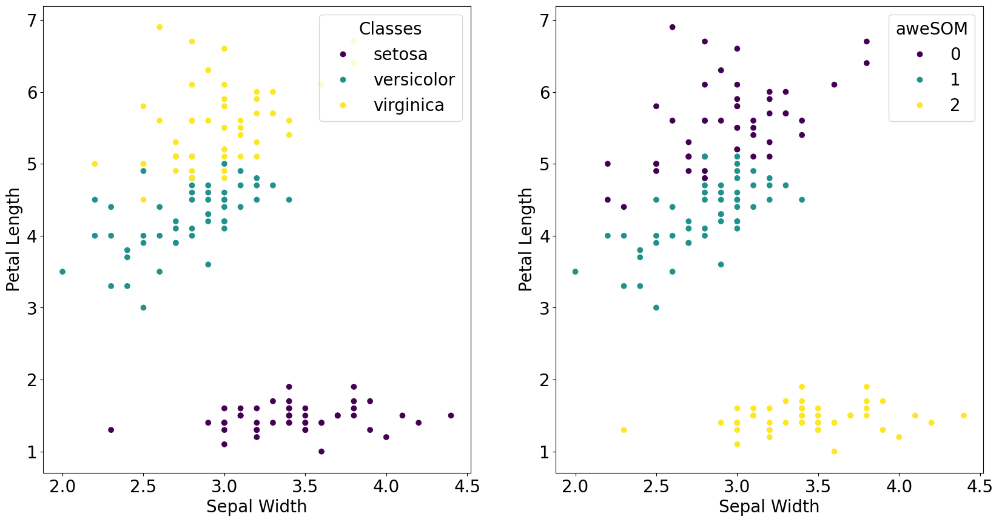
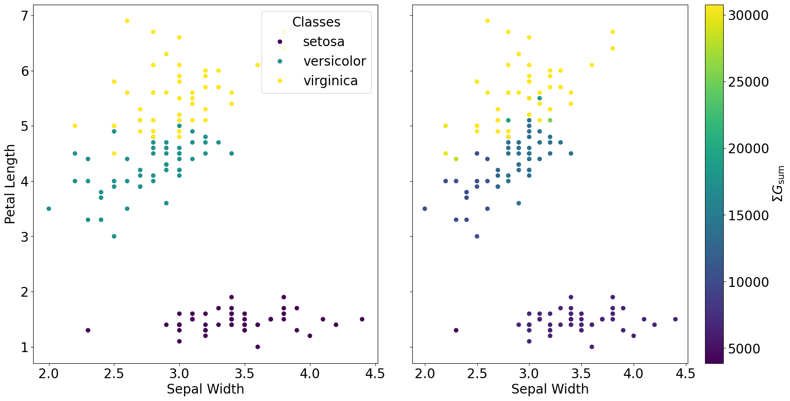

# aweSOM - Accelerated Self-organizing Map (SOM) and Statistically Combined Ensemble (SCE)

This package combines a JIT-accelerated and parallelized implementation of SOM, integrating parts of [POPSOM](https://github.com/njali2001/popsom) and a GPU-accelerated implementation of SCE using [ensemble learning](https://github.com/mkruuse/segmenting-turbulent-simulations-with-ensemble-learning). 
It is optimized for large datasets, up to $\sim 10^8$ points. 

aweSOM is developed specifically to identify intermittent structures (current sheets) in 3D plasma simulations ([Ha et al., 2024](https://arxiv.org/abs/2410.01878)).
However, it can also be used for a variety of clustering and classification tasks.

Authors: 

[Trung Ha](https://tvh0021.github.io) - University of Massachusetts-Amherst,
[Joonas Nättilä](https://natj.github.io) - University of Helsinki,
[Jordy Davelaar](https://jordydavelaar.com) - Princeton University.

Version: 1.0.0

## 1. Installation

1. Install aweSOM and required dependencies:

```bash
git clone https://github.com/tvh0021/aweSOM.git
cd aweSOM
pip install .
```

2. Install JAX with CUDA support separately:

```bash
pip install --upgrade "jax[cuda12_pip]" -f https://storage.googleapis.com/jax-releases/jax_cuda_releases.html
```

If your system does not support CUDA, you can skip this step. SCE will automatically fall back to the CPU. However, the 
CPU-only version can be significantly slower for large datasets (see the [performance tests](https://awesom.readthedocs.io/en/latest/testing.html#performance-tests)).

**Experimental** 

Apple Silicon users can also use JAX with Metal support; follow the instructions in the 
[JAX documentation](https://developer.apple.com/metal/jax/) to install the Metal backend.

## 2. Testing

We use `pytest` for the test module. Dependency has already been included in the `requirements.txt` file, and should be installed automatically with aweSOM.

To run tests for all modules in the root directory of aweSOM:

```bash
python -m pytest
```

You can also run specific test modules by specifying the path to the test file:

```bash
python -m pytest tests/[module]_test.py
```

Or run a specific test function within a module:

```bash
python -m pytest tests/[module]_test.py::test_[function]
```

If there is no GPU, or if the GPU is not CUDA-compatible, the `sce_test.py` module will fail partially. This is expected behavior, and SCE computation should still fall back to the CPU.

## 3. Basic Usage - SOM

Here are the basic steps to initialize a lattice and train the SOM to classify the Iris dataset.

The full Jupyter notebook can be found [here](examples/iris/iris.ipynb).

```python
import numpy as np
import matplotlib.pyplot as plt
from aweSOM import Lattice
```

First, load the dataset and normalize

```python
from sklearn.datasets import load_iris
iris = load_iris()

print("Shape of the data :", iris.data.shape)
print("Labeled classes :", iris.target_names)
print("Features in the set :", iris.feature_names)
```

```text
Shape of the data : (150, 4)
Labeled classes : ['setosa' 'versicolor' 'virginica']
Features in the set : ['sepal length (cm)', 'sepal width (cm)', 'petal length (cm)', 'petal width (cm)']
```

Normalize the data with a custom scaler

```python
import aweSOM.run_som as rs
iris_data_transformed = rs.manual_scaling(iris.data)
```
Initilize the lattice and train

```python
# Create an initial SOM instance
map = Lattice(xdim=40, ydim=15, alpha_0=0.5, train=100000)

# Train the SOM with some data in the shape of $N \times F$.
true_labels = iris.target
feature_names = iris.feature_names
map.train_lattice(iris_data_transformed, feature_names, true_labels)
```

The trained SOM is saved at  `map.lattice`

To visualize the SOM with U-matrix, which is saved at the end of training at `map.umat`

```python
# Compute the unique centroids
naive_centroids_matrix = map.compute_centroids() # return the centroid associated with each node
unique_centroids = map.get_unique_centroids(map.compute_centroids()) # return the indivual centroids

plot_centroids['position_x'] = [x+0.5 for x in unique_centroids['position_x']]
plot_centroids['position_y'] = [y+0.5 for y in unique_centroids['position_y']]

X,Y = np.meshgrid(np.arange(xdim)+0.5, np.arange(ydim)+0.5)

plt.figure(dpi=250)
plt.pcolormesh(map.umat.T, cmap='viridis')
plt.scatter(plot_centroids['position_x'],plot_centroids['position_y'], color='red', s=10)
plt.colorbar(fraction=0.02)
plt.contour(X, Y, map.umat.T, levels=np.linspace(np.min(map.umat),np.max(map.umat), 20), colors='black', alpha=0.5)
plt.gca().set_aspect("equal")
plt.title(rf'UMatrix for {xdim}x{ydim} SOM')
```


There are 15 centroids in this U-matrix -> there are 15 clusters. 
Now from the geometry of the U-matrix, we can see there are clearly at least two cluster (separated by the large band of high value nodes), and at most four clusters. 

Merge clusters using cost function

```python
merge_threshold = 0.2 # empirical tests reveal a threshold between 0.2 and 0.4 usually works best

# plot U-matrix with the connected components and ground truth labels (if the labels were supplied during map.train_lattice)
map.plot_heat(map.umat, merge=True, merge_cost=merge_threshold)
```



Now, we project each data point onto the lattice and get back cluster-id

```python
final_clusters = map.assign_cluster_to_lattice(smoothing=None,merge_cost=merge_threshold)
som_labels = map.assign_cluster_to_data(map.projection_2d, final_clusters)
```

Finally, we compare the aweSOM result to the ground truth

```python
fig, axs = plt.subplots(1, 2, figsize=(20, 10))
scatter_ground = axs[0].scatter(iris.data[:,1], iris.data[:,2], c=iris.target, cmap='viridis')
axs[0].set_xlabel('Sepal Width')
axs[0].set_ylabel('Petal Length')
axs[0].legend(scatter_ground.legend_elements()[0], iris.target_names, loc="upper right", title="Classes")
scatter_som = axs[1].scatter(iris.data[:,1], iris.data[:,2], c=som_labels, cmap='viridis')
axs[1].set_xlabel('Sepal Width')
axs[1].set_ylabel('Petal Length')
axs[1].legend(scatter.legend_elements()[0], np.unique(final_clusters), loc="upper right", title="aweSOM")
plt.show()
```



Clearly, the mapping is: {'setosa' : 2, 'versicolor' : 1, 'virginica' : 0} 

```python
# Assign cluster number to class label; change manually
label_map = {'setosa' : 2, 'versicolor' : 1, 'virginica' : 0}
correct_label = 0

for i in range(len(som_labels)):
    if int(som_labels[i]) == label_map[iris.target_names[iris.target[i]]]:
        correct_label += 1

print("Number of correct predictions: ", correct_label)
print("Accuracy = ", correct_label/len(som_labels) * 100, "%")

# Precision and Recall by class
precision = np.zeros(3)
recall = np.zeros(3)

for i in range(3):
    tp = 0
    fp = 0
    fn = 0
    for j in range(len(som_labels)):
        if int(som_labels[j]) == label_map[iris.target_names[i]]:
            if iris.target[j] == i:
                tp += 1
            else:
                fp += 1
        else:
            if iris.target[j] == i:
                fn += 1
    precision[i] = tp/(tp+fp)
    recall[i] = tp/(tp+fn)

print("Precision: ", [float(np.round(precision[i],4))*100 for i in range(3)], "%")
print("Recall: ", [float(np.round(recall[i],4))*100 for i in range(3)], "%")
```

```text
Number of correct predictions:  141
Accuracy =  94.0 %
Precision:  [100.0, 90.2, 91.84] %
Recall:  [100.0, 92.0, 90.0] %
```

Is the performance of the aweSOM model.

## 4. Basic Usage - SCE

If a dataset is complex, a single SOM result might not be sufficiently stable.
Instead, we can generate multiple SOM realizations with slightly different initial parameters, then stack the results into a set of statistically significant clusters.

Let's use the same Iris dataset:

```python
from aweSOM.run_som import save_cluster_labels
# set a parameter space to scan
parameters = {"xdim": [38, 40, 42], "ydim": [14, 16], "alpha_0": [0.1, 0.5], "train": [10000, 50000, 100000]}
merge_threshold = 0.2

for xdim in parameters["xdim"]:
    for ydim in parameters["ydim"]:
        for alpha_0 in parameters["alpha_0"]:
            for train in parameters["train"]:
                print(f'constructing aweSOM lattice for xdim={xdim}, ydim={ydim}, alpha={alpha_0}, train={train}...', flush=True)
                map = Lattice(xdim, ydim, alpha_0, train, )
                map.train_lattice(iris_data_transformed, feature_names, labels)
                # projection_2d = map.map_data_to_lattice()
                final_clusters = map.assign_cluster_to_lattice(smoothing=None, merge_cost=merge_threshold)
                som_labels = map.assign_cluster_to_data(projection_2d, final_clusters)
                save_cluster_labels(som_labels, xdim, ydim, alpha_0, train, name_of_dataset='iris')
```

This saves 36 realizations to the current working directory.

In the terminal (skip this step if you use the pre-generated files):

```bash
cd [path_to_aweSOM]/aweSOM/examples/iris/
mkdir som_results
mv labels* som_results/
```

Then,
```bash
cd som_results/
python3 [path_to_aweSOM]/aweSOM/src/aweSOM/sce.py --subfolder SCE --dims 150
```

This will create (or append to) the `multimap_mappings.txt` file inside `som_results/SCE/` with the $G_{\rm sum}$ for each cluster. It also save the mask for each cluster $C$ as a `.npy` file.  

In its simplest form, the SCE stacking can be performed point-by-point: $V_{\rm SCE, i} = \Sigma_C M_i \cdot G_{\rm sum, C}$

Get the list of $G_{\rm sum}$ values, sorted in descending order

```python
file_path = 'som_results/SCE/'
file_name = 'multimap_mappings.txt'

from aweSOM.make_sce_clusters import get_gsum_values, plot_gsum_values

ranked_gsum_list, map_list = get_gsum_values(file_path+file_name)
```

Add these values together

```python
sce_sum = np.zeros((len(iris_data_transformed)))
for i in range(len(ranked_gsum_list)):
    current_cluster_mask = np.load(f"{file_path}/mask-{map_list[i][2]}-id{map_list[i][1]}.npy")
    sce_sum += current_cluster_mask
```

Visualize the result

```python
fig, axs = plt.subplots(1, 2, figsize=(20, 10))
scatter_ground = axs[0].scatter(iris.data[:,1], iris.data[:,2], c=iris.target, cmap='viridis')
axs[0].set_xlabel('Sepal Width')
axs[0].set_ylabel('Petal Length')
axs[0].legend(scatter_ground.legend_elements()[0], iris.target_names, loc="upper right", title="Classes")
scatter_sce = axs[1].scatter(iris.data[:,1], iris.data[:,2], c=sce_sum, cmap='viridis')
axs[1].set_xlabel('Sepal Width')
axs[1].set_ylabel('Petal Length')
plt.colorbar(scatter_sce, ax=axs[1])
plt.show()
```



Set a cutoff in $\Sigma G_{\rm sum}$ to obtain three clusters

```python
signal_cutoff = [8000, 15000]

sce_clusters = np.zeros((len(iris_data_transformed)), dtype=int)
for i in range(len(sce_sum)):
    if sce_sum[i] < signal_cutoff[0]:
        sce_clusters[i] = 0
    elif sce_sum[i] < signal_cutoff[1]:
        sce_clusters[i] = 1
    else:
        sce_clusters[i] = 2
```

The resulting SCE quality is (using the same code as in 2.):

```text
Number of correct predictions:  142
Accuracy =  94.66666666666667 %
Precision:  [100.0, 92.0, 92.0] %
Recall:  [100.0, 92.0, 92.0] %
```

Because of the simplicity of the Iris dataset, not much improvement is made with SCE, but the result is nevertheless consistent with the single SOM result.

## 5. Advanced Usage - Plasma Simulation

The Jupyter Notebook for the fiducial realization of SOM lattice is located [here](examples/plasma-turbulence/plasma.ipynb).

## 6. License

This project is licensed under the MIT License - see the [LICENSE](LICENSE) file for details.

## 7. Contributing

Anyone is welcome to contribute! Please fork the repository and create pull requests with proposed changes.

## 8. Contact

Additional inquiries/questions about aweSOM should be directed to my email: [tvha@umass.edu](mailto:tvha@umass.edu)